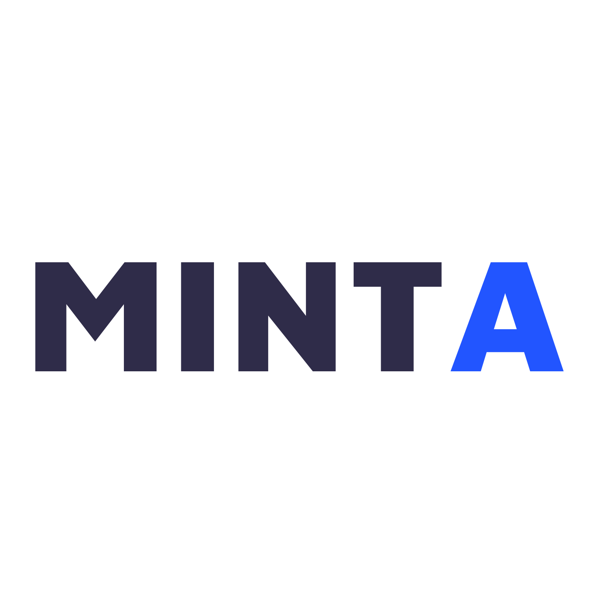

# MINTA
## Four students hack their way through the Soalnd Riptide Hackathon

<!-- PROJECT LOGO -->
 

  

<h2 align="center">MINTA</h2>

  

    minta.world
     
    <a href="https://github.com/AdamSioud/Minta"><strong>Explore the webiste »</strong></a>
      
      <a href="https://github.com/AdamSioud/MINTA-IOS-APP"><strong>Explore the IOS Repo »</strong></a>
         
    <a href="https://www.youtube.com/watch?v=8Y1IvOnife8&list=RDMM&start_radio=1&rv=PzGFauqHF-U">View Demo</a>
  

<!-- ABOUT THE PROJECT -->
## About The Project

Check out the IOS REPO to look at the application we are building and its files.

(<a href="#top">back to top</a>)

### Built With

* [Swift](https://nextjs.org/)
* [Tatum.io](https://reactjs.org/)
* [Solana](https://vuejs.org/)
* [Bootstrap](https://getbootstrap.com)

(<a href="#top">back to top</a>)

<!-- CONTACT -->
## Contact

MINTA - [@twitter_handle](https://twitter.com/minta_world) - 4frabrain@gmail.com

<!-- ACKNOWLEDGMENTS -->
## TEAM MEMBERS

* [Adam]()
* [Even]()
* [Elisabeth]()
* [Jørgen]()

(<a href="#top">back to top</a>)

<!-- MARKDOWN LINKS & IMAGES -->
<!-- https://www.markdownguide.org/basic-syntax/#reference-style-links -->
[contributors-shield]: https://img.shields.io/github/contributors/github_username/repo_name.svg?style=for-the-badge
[contributors-url]: https://github.com/AdamSioud/MINTA/graphs/contributors
[forks-shield]: https://img.shields.io/github/forks/github_username/repo_name.svg?style=for-the-badge
[forks-url]: https://github.com/github_username/repo_name/network/members
[stars-shield]: https://img.shields.io/github/stars/github_username/repo_name.svg?style=for-the-badge
[stars-url]: https://github.com/github_username/repo_name/stargazers
[issues-shield]: https://img.shields.io/github/issues/github_username/repo_name.svg?style=for-the-badge
[issues-url]: https://github.com/github_username/repo_name/issues
[license-shield]: https://img.shields.io/github/license/github_username/repo_name.svg?style=for-the-badge
[license-url]: https://github.com/github_username/repo_name/blob/master/LICENSE.txt
[linkedin-shield]: https://img.shields.io/badge/-LinkedIn-black.svg?style=for-the-badge&logo=linkedin&colorB=555
[linkedin-url]: https://www.linkedin.com/in/adam-sioud-316b48191/
[product-screenshot]: images/screenshot.png
